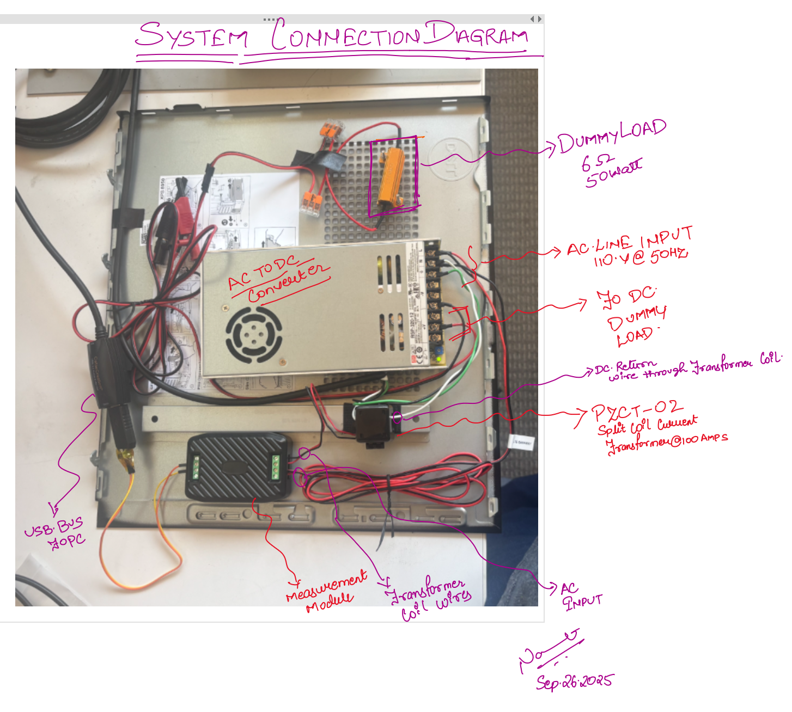
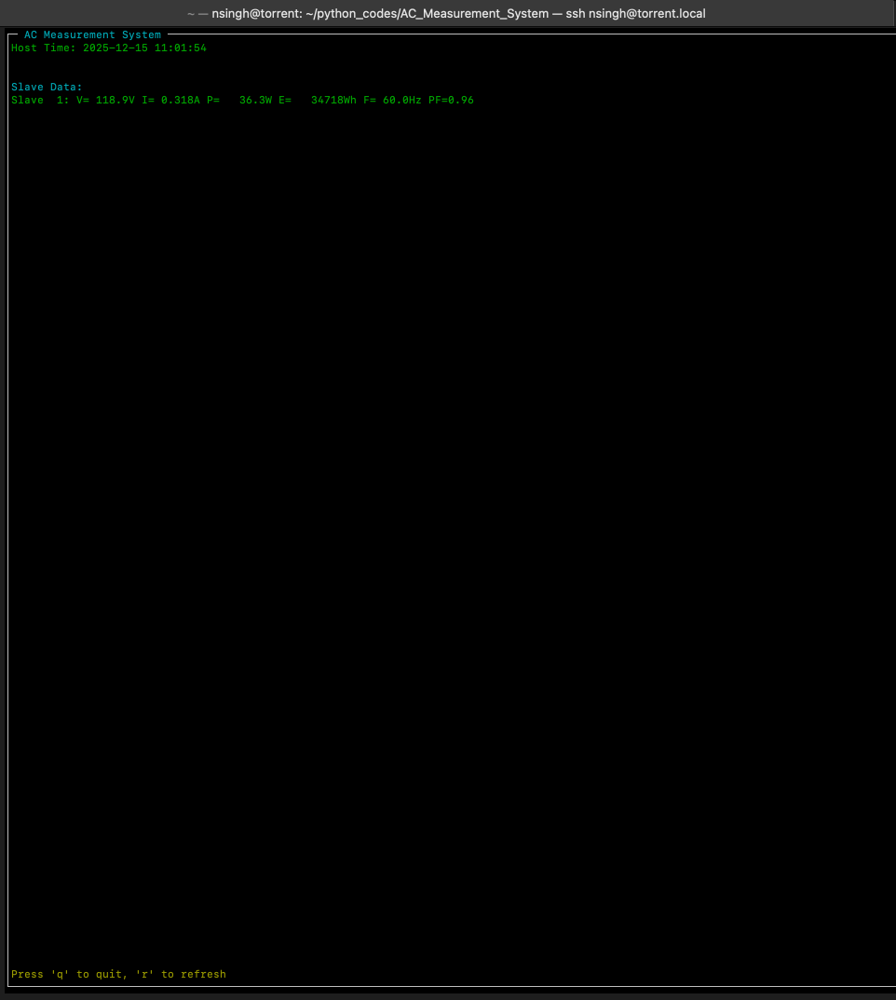

<!-- Jai Guru Dev -->
<!-- AC Measurement System with Modbus Measurement -->

## AC Voltage Current and PowerFactor Measurement System
Author : Navneet Singh <br>
Lang   : Python3       <br> 

This system measures AC voltage (80-260V), current (0-100A), active power (0-23kW), frequency (45-65Hz), power factor (0.00-1.00), and energy consumption through RS485 Modbus-RTU communication protocol. Perfect for power monitoring, generator load balancing, and energy management applications. 

## Project Video Blogs 
Project Description Video : 
https://youtu.be/QOBo3sWSI8o<br>
Software Walk Through Video : 
[coming soon]
## Table of Contents
- [System Block Diagram](#hardware-block-diagram)
    - [System Description](#system-description)
    - [Component List](#component-list)
- [USB Interface BringUP](#usb-interface-bringup) 
- [Software Interface](#software-interface)
    - [MODBUS Communication](#modbus-communication)
  - [Virtual CAN Setup](#virtual-can-setup)
    - [Prerequisites](#require-modules)
    - [Create Virtual CAN Interface](#create-virtual-can-interface)
- Python Virtual Environment
  - [PyEnv Setup](#pyenv-setup)
  - [Installation](#installation)
  - [Usage](#usage)

## Hardware Block Diagram
The connection diagram to connect the measuremnt system through the Tranformer coil.
<br>
<p>
The AC measurement module uses AC voltage to power itself up. if the AC power goes out then then the whole system will fail and not provide any readings to the MODBUS master command to read the measurement register.

The wire going through the Measurement Transformer is the return wire of the AC input to the load. i.e. in the system shown below we are using return wire from the AC to DC converter. 
</p>


<p><div align="center"> IMAGE-1 - Hardware Block Diagram 
</div> </p>

## Component List
**Measurement Module**  : PZEM-016<br>
**Coil Transformer**    : PZCT-02<br>
**RS485 to USB**        : Future Technology Devices International, Ltd FT232<br>
**AC to DC Converter**  : MeanWell AGP-120-12<br>

## USB Interface Bringup

### Prerequisites
The USB device must be accessible to your user account after plugging in. By default, it belongs to the `dialout` group.

### Step 1: Check Device Permissions
First, verify the current permissions of your USB device:

```bash
ls -l /dev/ttyUSB0
```

**Expected Output:**
```
crw-rw---- 1 root dialout 188, 0 Sep 26 16:42 /dev/ttyUSB0
```

> **Note:** This output indicates that only `root` and members of the `dialout` group can access the device.

### Step 2: Add User to Dialout Group
Add your user to the `dialout` group for permanent access:

```bash
sudo usermod -a -G dialout $USER
```

> **⚠️ Important:** You need to **logout and login again** for the group changes to take effect.

### Step 3: Alternative Quick Fix (Temporary)
If you need immediate access without logging out:

```bash
# Temporary fix - grants access until next reboot
sudo chmod 666 /dev/ttyUSB0
```

### Step 4: Test Communication
Once permissions are set, test the communication with minicom:

```bash
minicom -b 9600 -D /dev/ttyUSB0
```

**Parameters:**
- `-b 9600`: Baud rate (9600 bps)
- `-D /dev/ttyUSB0`: Device path

## Software Interface
<p style="text-align: justify">
Python scripts interface with the sensing module to retrieve measurements from the device.

Communication uses `RS485` as the physical layer with `MODBUS` as the application layer protocol. A `USB` to `RS485` converter enables communication with an x86 machine, which acts as the MODBUS master on the RS485 bus.
</p>

### Modbus Communication 
<p style="text-align: justify">
Python liberary `MinimalModbus` is used to communicate as the master on the bus which is created. The lib can interface with a variety of physical layers including `serial` `RS485` `tcp`. 

For our applicaion in the setup defined above we will deal with the communicaiton as if we are dealing with a serial bus as the serial to `RS485`

Using RS485 provides the advantage of connecting multiple sensors on the same two-wire bus in a daisy-chain configuration. This eliminates the need for additional UART devices and simplifies system wiring, as each sensor can be addressed uniquely through the MODBUS protocol on the shared RS485 bus.


### Software Visualizer 

`minimalmodbus` python module is used to interpret the protocol layer.

### Running the TUI Visualizer

The provided TUI (Text User Interface) visualizes live AC measurement data from all connected MODBUS slave devices. It uses the `curses` library for a terminal-based interface that refreshes periodically and can be manually updated by pressing "r" in the UI.

To set up the environment and launch the TUI:

1. **Environment Setup:**  
   In the main folder, you will find a `.sh` script that configures a Python virtual environment and installs all dependencies automatically. Run:
   ```bash
   ./setup_and_run.sh
   ```
   This script will activate the venv, install requirements.

2. **Manual Run:**  
   Alternatively, after activating the Python venv manually, you can launch the visualizer by running:
   ```bash
   python AC_Measurement_System/main.py
   ```

Once started, the TUI will display real-time voltage, current, power, and energy values for each slave on the RS485 bus. Press "r" to refresh immediately or "q" to quit the TUI.


<p><div align="center"> IMAGE-2 - TUI in action
</div> </p>
