<div align="center">
  <h1>HYDRA ML V5 (Mahanidra PoC)</h1>
</div> 

<div align="left">
 <p>
    <h1>Key Features of HYDRA ML V5 </h1>

  Navneet Singh (Jan/14/2024)

  1. **Dual Radar Triggering**  
     - Supports triggering for **front-facing** and **rear-facing** radar systems.  

  2. **Synchronization Update**  
     - Front cameras are now synchronized exclusively with front-facing equipment.  
     - Rear-facing cameras and radars systems operate independently. (no sync)  

  3. **Frequency Specifications**  
     - Camera HYDRA operates at **40 MHz**.  
     - Radar Triggering HYDRA now operates at **40 MHz**.<br>
      **NOTE :** In older version of the ML HYDRAs this HYDRA runs at 50MHz and only support TI radar heads.  
     - The last bit previously used for switching between camera and radar triggering has been deprecated due to the frequency difference and the BITSTREAM file becoming too big to hold all of the various time values.  

  ---
  ## Deprecation Notice  

  - **HYDRA ML V4**: Components are no longer interchangeable between front and rear systems.  
  - **Older Versions**: HYDRA ML V3 supported frame alignment between LiDAR, radar, and cameras. Documentation for older versions (e.g., V1.0.0) can be found under the [HYDRA Git repository tags](#).  

  ---

  _Last updated: January 13, 2024, by Navneet Singh_

  ---

  ### Notes for Developers  

  Refer to the appropriate version tags in the Git repository for details about deprecated features or backward compatibility.  

</p></div>

<br />

<!-- Table of Contents -->
# :notebook_with_decorative_cover: Table of Contents

- [About the Project](#about-the-project)
  * [HARDWARE SETUP CHANGES](#hardware-setup-changes)
  * [HARDWARE CAR SETUP](#hardware-car-setup)
  * [HYDRA ML SETUP DESCRIPTION](#hydra-ml-setup-description)
    - [HYDRA MODE SELECTION](#mode-configuration)
    - [HYDRA CLOCK](#clocks-configuration)
    - [HYDRA HW MODIFICATIONS](#hydra-hw-modifications)
  * [TIMING DIAGRAMS](#timing-diagrams)
    - [HYDRA CAMERA TIMING DIAGRAMS](#radar-head-trigger-timing-diagram-calculation)
    - [HYDRA CAMERA FW STATE TIMING DIAGRAMS](#camera-fw-trigger-timing-diagram-calculation)
- [FIRMWARE](#firmware)
  * [FIRMWARE IMAGES DESCRIPTION](#firmware-images-description) 
  * [FOLDER STRUCTURES](#folder-structure)
  * [SIMULATION](#simulation)
  * [COMPILATION REPORT](#compilation-report)
- [SCOPE SNIPPETS](#scope-snippets)
- [RELEASES](#releases)  

<!-- About the Project -->
##  About the Project
<p><div align="left">
The V5 of the firmware is written in order to align to the frames of Lidar, Radar both front and back and the  front Camera(not backward facing camera) all at 10Hz frequency signal coming from lidar.<br><br>
The hardware supported by this version of hydra is only for NXP versions of Gen3 radar heads which are running at 40MHz and a reduced clock voltage. TI rHeads are not supported in this firmware.<br><br>
 
50MHz radar heads are not supported in this firmware. They have to be on their own clock if MRR mode is used. BUT DAR mode for TI is not supported with this  revision of firmware.

Only the Newer Version of Cameras i.e. LEPARD are supported as the camera trigger is 2x frequency as of Lidar. 

---
### SYSTEM DIAGRAM

</div>
</p>
<div align="center">
  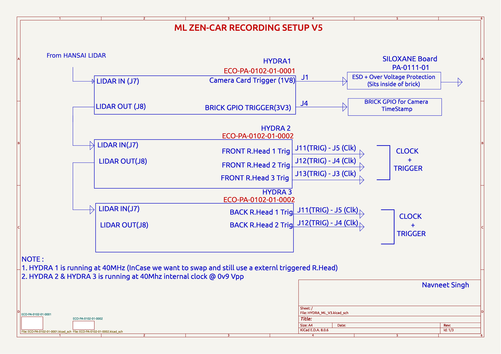
  <p>Image 1 : HYDRA PCB </p>
</div>

<div align="center">
  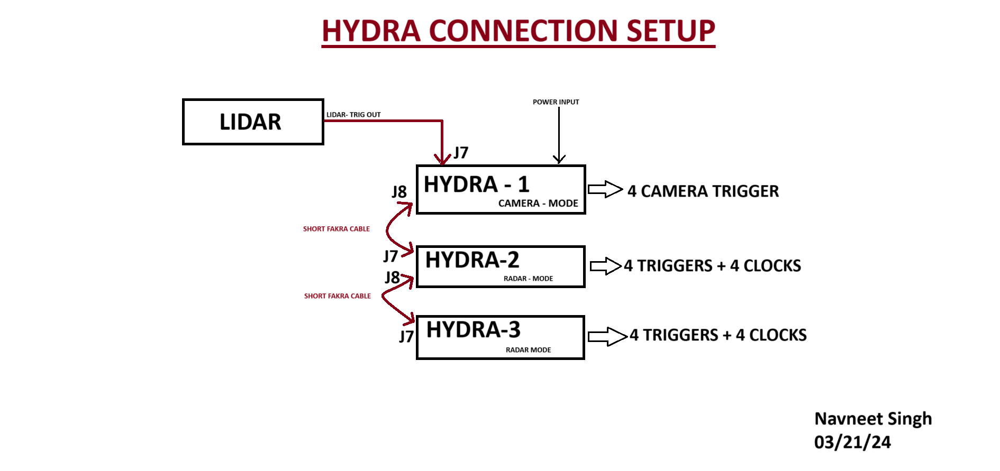
  <p>Image 1 : HYDRA PCB </p>
</div>

<!-- Screenshots -->
###  Hardware Setup Changes

### Hardware Car Setup 
<p>
  The car setup is described in the image below. The set of chirp profiles are needed in this configuration of the Recording, for the radars in monostatic modes, in order to avoid interference.

  **FRONT FACING RADAR CONFIGRATIONS** <br>
  BOT LEFT : trigger @ 0 us<br>
  TOP CENTER : trigger @ 8us<br>
  BOT RIGHT : trigger @ 16us<br>

  **REAR FACING RADAR CONFIGRATIONS** <br>
  BOT LEFT : trigger @ 0 us<br>
  BOT RIGHT : trigger @ 8 us<br>
    
  <div align="center">
  
  <p>Image 1 : FRONT FACING RADAR CONFIGURATION </p>
  </div>

  <div align="center">
  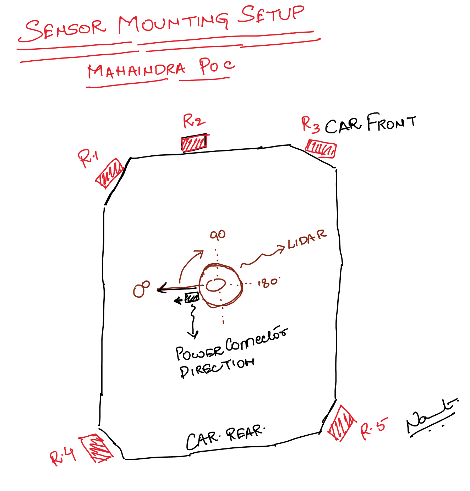
  <p>Image 2 : ML SENSOR MOUNTING POSITIONS </p>
  </div>


</p>
<p><div style="text-align: left"> 
Each Hydra is clearly labelled what firmware it runs.<br>
HYDRA FIRMWARE CONFIGURATIONS in ZIM STACK<br>
  1.  CAMERA HYDRA - TOP of the stack<br>
  2.  FRONT RADAR HYDRA - MIDDLE of hydra stack.<br>
  3.  REAR RADAR HYDRA - BOTTOM of hydra stack<br>
<br><br>


<!-- Screenshots -->
###  Hydra ML Setup Description
#### Clocks Configuration
<p><div align="left">
The output clocks from the HYDRA_1 in this firmware version is 40MHz. These clocks are to be connected to the MRR Radar Heads. The clock is present irrespective of the configuration of the output signal i.e. Camera HYDRA output a 40MHz clocks on these connectors.


The output clocks from the HYDRA_2 & HYDRA_3 in this firmware version is 40MHz. These clocks are to be connected to the Radar Heads (Rev3 and Greater). The clock is present irrespective of the configuration of the output signal. The output signal of the clock signals are 0V9, so TI radars can not be supported for this HYDRA stack.

Clocks are 0V9 peak to peak. TI Radars are not supported in this setup.<br>
Navneet will attach a scope shot of the clock signal here!!

</div></p>

<p>
<h4>RADAR HYDRA MODE SELECTION</h4>
The radar hydras can be in two modes.Image describes the way to configure it.<br> 
 MODE 1 :  Generating triggers for front radars.<br>
 MODE 2 :  Generating triggers for rear radars.<br>

<div align="center">
  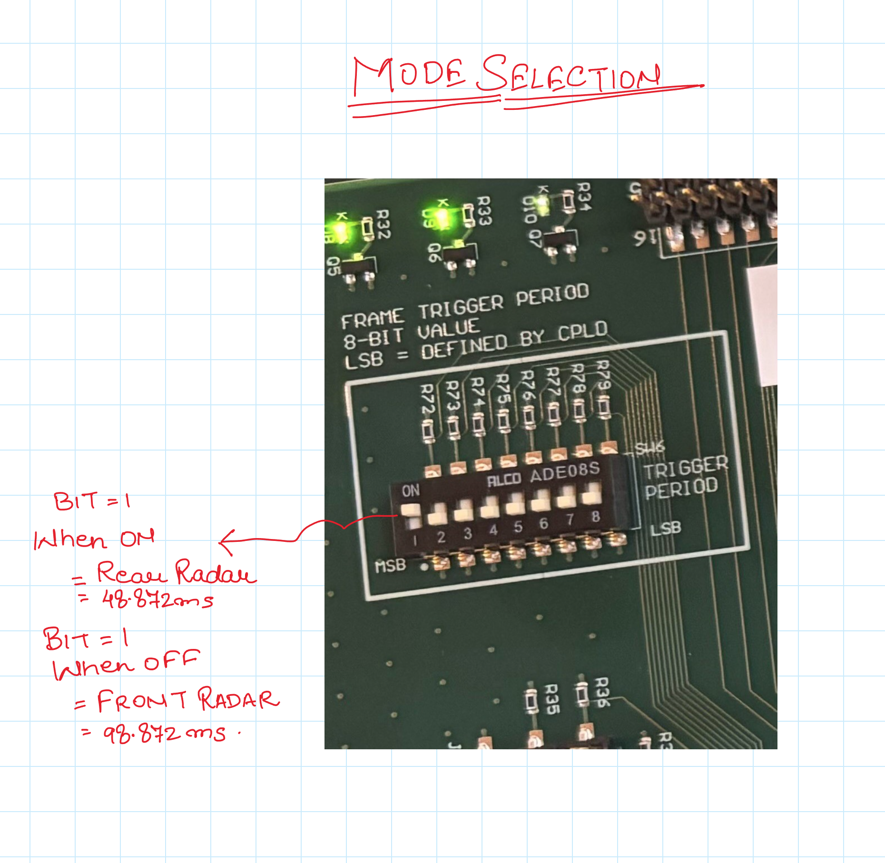
  <p>Image 2 : ML SENSOR MOUNTING POSITIONS </p>
  </div>
</p>


#### FIRMWARE VERSIONS
<p>
<div align="left">
  Version 5 : 
  <br> This set of firmware in HYDRA is only deigned for ML setup for NXP radars.
  it is different from the ML car in zendar Berkeley office.
  
  SETUP CHANGES :<br>
  1. LIDAR position is different.<br>
  2. Rear Radars are sitting at diffent timing than the front radar.<br>
  3. Camera Signal HYDRA is similar to rev4. the first FAKRA is only for the FPGA frame grabber card.

  <br>
  Version 4 : 
  <br> This version of HYDRA firmware does not have the capability to switch between Radar and Camera triggers. The trigger timings are tied in the binary files that gets flashed into the CPLD. The Switch below has no effect in the version 4 of the firmware.<br><br>

  [Deprecated STUFF from Version 3]<br>
   ~~The HYDRA can be configured in two modes.~~ ~~First mode is for generating a trigger for the camera and the second mode is designed to generate a trigger for the radar heads~~ <br><br>
   ~~SW = HIGH : RADAR Trigger MODE~~<br>
   ~~SW = LOW : CAMERA Trigger MODE~~ 

  <div align="center">
  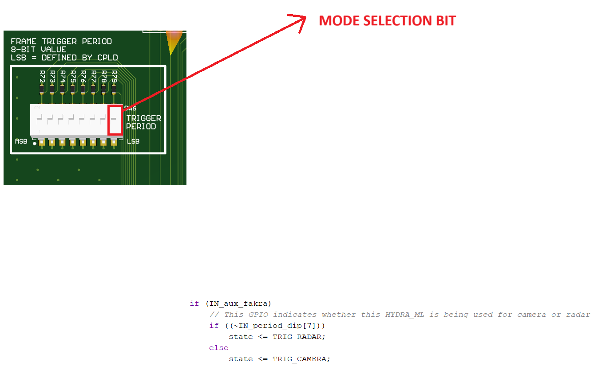
  <p>Image 2 : HYDRA OUTPUT MODE SELECT SWITCH (only on V3)</p>

</div>
</div></p>

#### Hydra HW Modifications
##### CAMERA HYDRA_1
<p><div align="left">
Only change the clock lines to be 44 ohms and remove the R38 and R39 resistors from the PCB.
The first FAKRA is set to output 1V8 volts for the FPGA frame grabber card.

 <div align="center">
  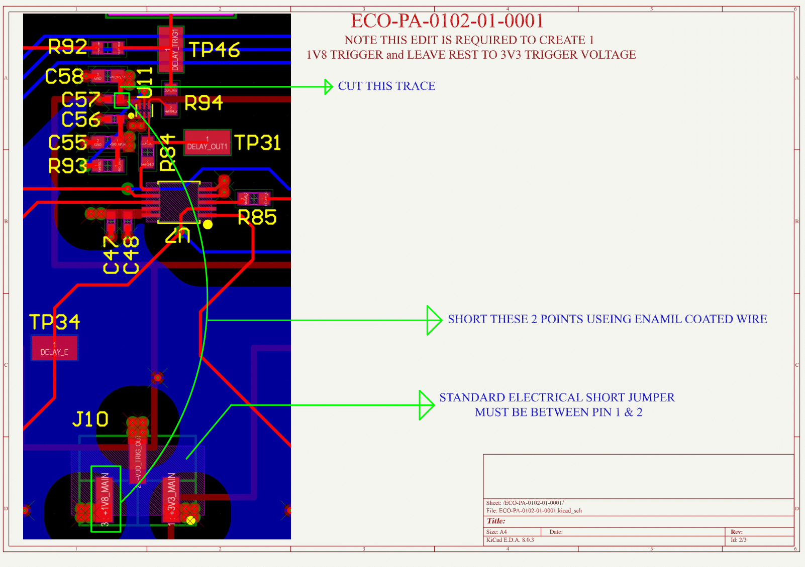
  <p>Image 2 : HYDRA Modifications Required on HYDRA_1 for camera.</p>

</div></p>

##### RADAR HYDRA_2 & HYDRA_3
<p><div align="left">
  The HYDRA which is used to generate the trigger for the Radars needs to follow the modifications specified in the Engineering Change Order ECO-PA-0102-01-0002. 
  This ECO will enable the HYDRA to run at a clock of 50MHz. The firmware in  the CPLD expects a 50MHz clock signal as input.<br>
  These modifications are same as the ones specified in the git repo HYDRA_50MHZ branch readme.<br><br>
    
  <div align="center">
  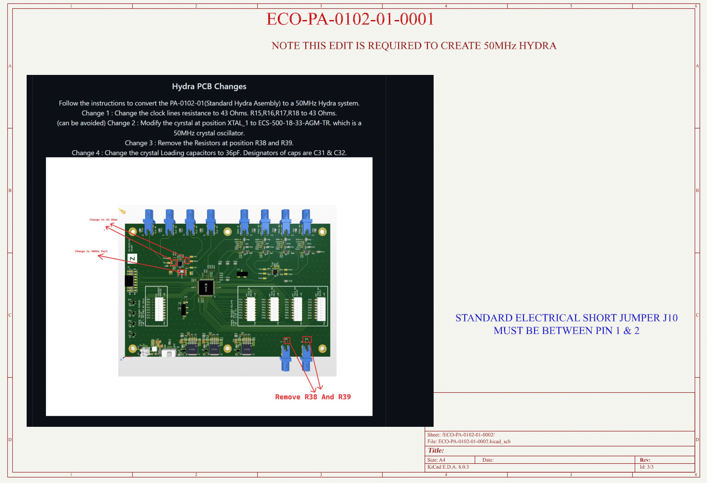
  <p>Image 2 : HYDRA Modifications Required on HYDRA_2 and HYDRA_3</p>

</div></p>
<!-- Screenshots -->

#### Timing Diagrams

#### Radar Head Trigger Timing Diagram Calculation 
<p><div align="left">
  The timing diagram of the whole ML acquisition system is depicted in the image below.<br>
  The camera trigger are aligned with the input trigger from lidar. Because lidar will sends a trigger pulse at 180deg (eg: when it is facing toward the front of the car). @ Lepord cameras use a 20Hz signal to align the frames.<br> 

---

  The radar triggers generated by the HYDRA are offset from the input lidar trigger by a value of xxxxusec. This is done to align the radar frame with the lidar frame at the front of the car and the back of the car.

  <div align="center">
    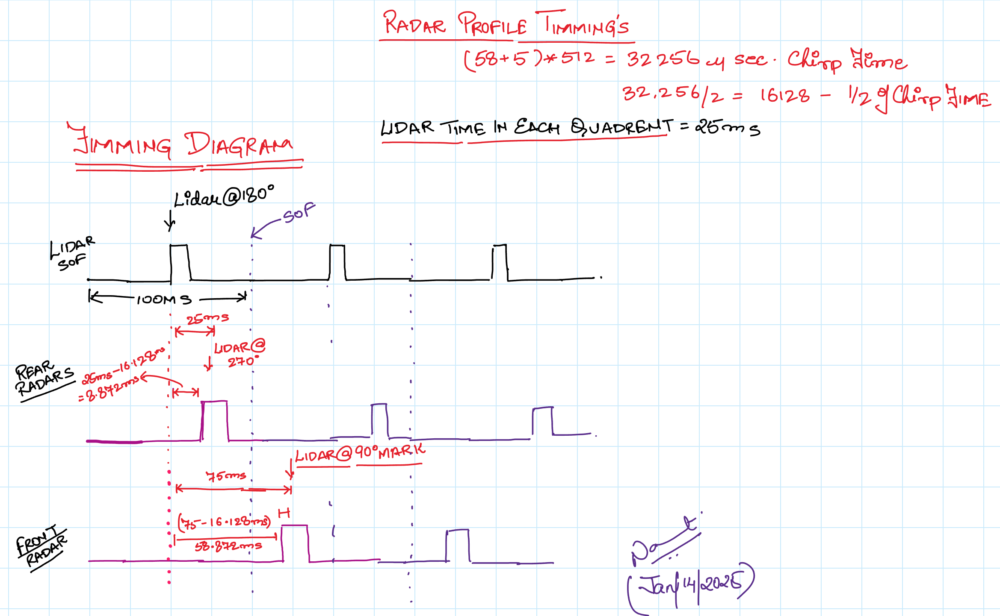
    <p>Image 3 :Timing Calculation for radar trig delay </p>
  </div>

  <div align="center">
    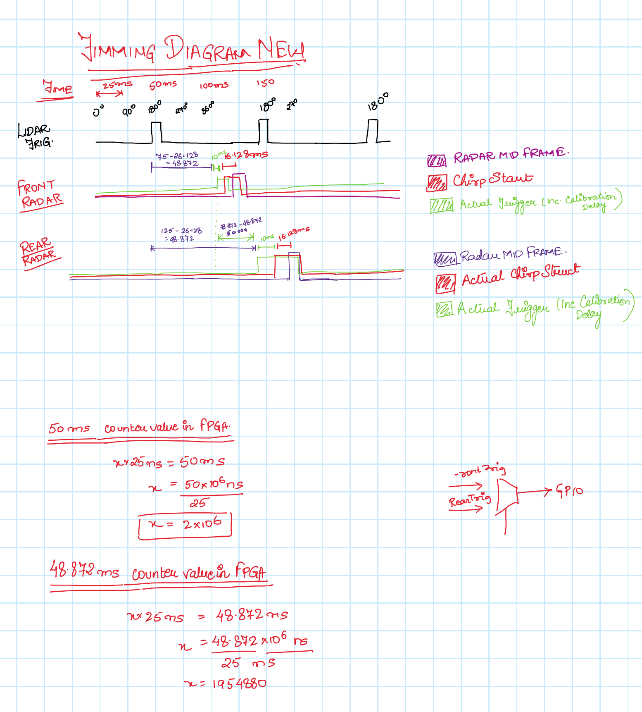
    <p>Image 4 :  Timing Calculation for radar trig delay 10ns compensation for radar calibrations before frame start </p>
  </div>
</div></p>

#### Camera FW Trigger Timing Diagram Calculation
  <p><div align="left">
  The Calulations for the HYDRA trigger numbers coded in the HYDRA CPLD firmware are attached in the following equations. 
  
  <div align="center">
    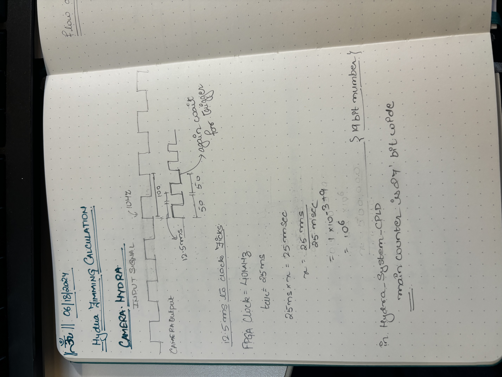
    <p>Image : PAGE1 Timing Calculation for camera trig delay </p>
  </div>

  <div align="center">
    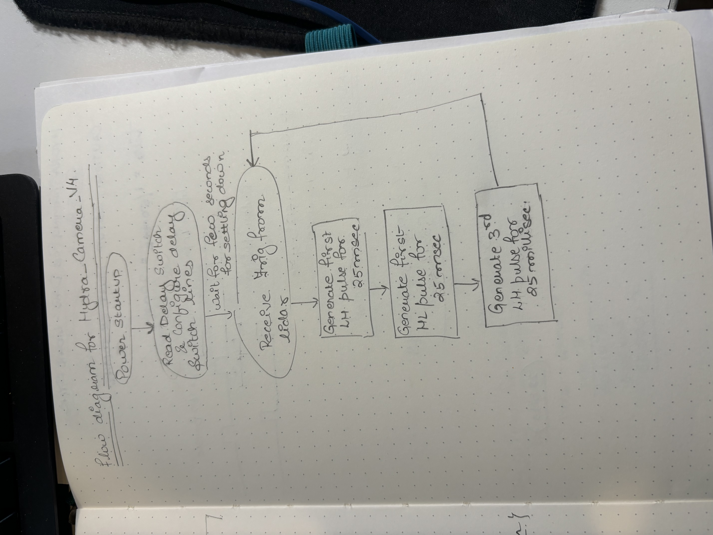
    <p>Image : PAGE2 State Machine Diagram</p>
  </div>
  

  </div></p>

#### RADAR FW Trigger Timing Diagram Calculation
  <p><div align="left">
  The Calulations for the HYDRA trigger numbers coded in the HYDRA CPLD firmware are attached in the following equations. 
  
  <div align="center">
    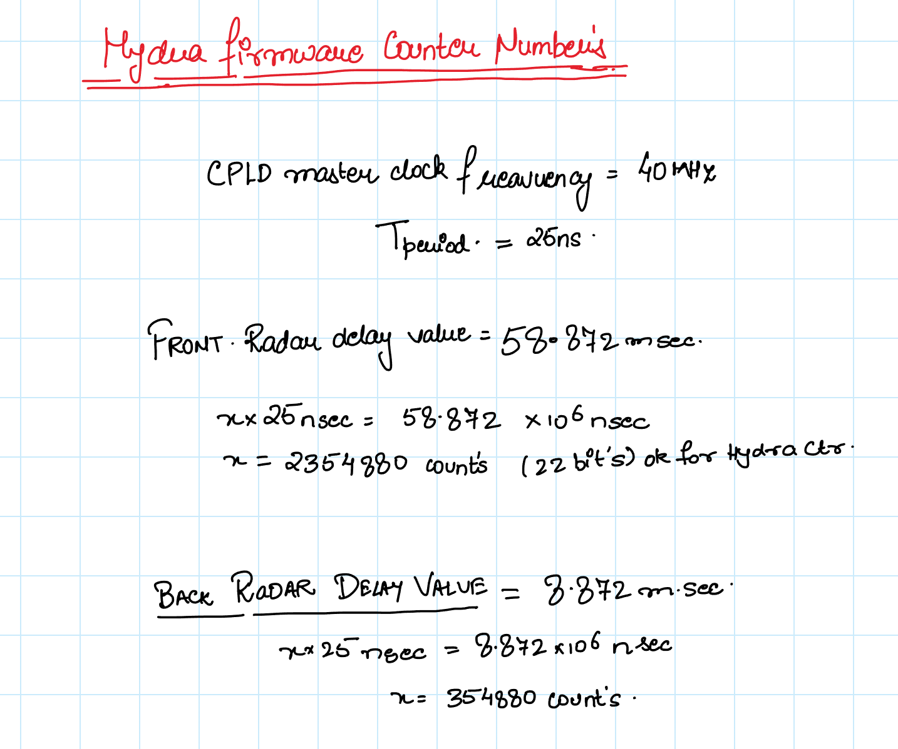
    <p>Image : PAGE3 Timing Calculation for radar trig delay </p>
  </div>

  <div align="center">
    
    <p>Image : PAGE4 State Machine Diagram</p>
  </div>
  

  </div></p>

##  FIRMWARE
#### FIRMWARE IMAGES DESCRIPTION
  <p><div align="left">
  There are 2 different FPGA project in the git, one for the Camera HYDRA and one for the Radar trig HYDAR.<br><br>
  BUILD folder also has two images.Use the following files for each HYDRA<br>
    1. HYDRA_CAMERA_ML_v4.jed<br>
    2. HYDRA_RADAR_ML_v4.jed<br><br>

  SIMULATION Files are also split into two different folders, each containing the source files and the tech bench files for simulation.
  ```Console
    └───SIMULATION
          └───Design_Debug_Notes
          └───CAMERA_FIRMWARE
                  └───HYDRA_ML_v4.v  (This is Source Verilog for Camera)
                  └───Test_bench.v (this is the test bench file)
          └───RADAR_FIRMWARE
                  └───HYDRA_ML_v4.v  (This is Source Verilog for Radar)
                  └───Test_bench.v (this is the test bench file)
  ```

  The compiler report can be found in the following locations:<br>
  CAMERA - The compilation report can be found here!!
  <br>
  RADAR - The compilation report can be found here!!
  <br>
 
  <br><br>
  </p></div>

##### Folder Structure

``` Console
E:.
├───assets
│   └───Firmware_writeups
├───BUILD
├───HARDWARE_DESIGN_FILES
│   └───BLOCK_DIAGRAM
│       ├───DoCs
│       └───HYDRA_ML_V4
│           ├───HYDRA_ML_V3-backups
│           └───IMAGES
├───ISE_PROJECT
│   ├───CAMERA
│   │   └───Hydra_ML
│   │       ├───iseconfig
│   │       ├───verilog
│   │       ├───xlnx_auto_0_xdb
│   │       ├───xst
│   │       │  
│   │       ├───_ngo
│   │       └───_xmsgs
│   └───RADAR
│       └───Hydra_ML
│           ├───Hydra_CPLD_html
│           │ 
│           ├───iseconfig
│           ├───verilog
│           ├───xlnx_auto_0_xdb
│           ├───xst
│           │  
│           ├───_ngo
│           └───_xmsgs
└───SIMULATION
    ├───CAMERA_FIRMWARE
    ├───Design_Debug_Notes
    └───RADAR_FIRMWARE
```


<!-- Simulation -->
##### Simulation 
<p> (NEW IMAGES needed to be generated by Navneet Singh)<br><br>
Simulation of the Verilog Code is done in VIVADO 22.02 follow the guide to simulate. Works only on windows machines.
Xilinx Sources contain the test bench.v which is responsible for generating the stimulus for the verilog FSM code.

<div align="center">
  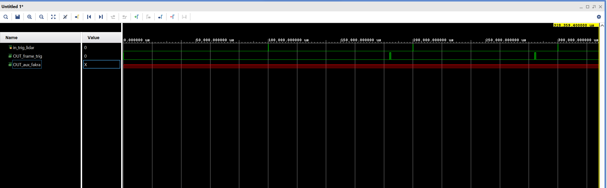
  <p>Image 3 :Timing Calculation for radar trig delay </p>
</div>

</p>

Configuring the Delay Lines IC 
<div align="center">
  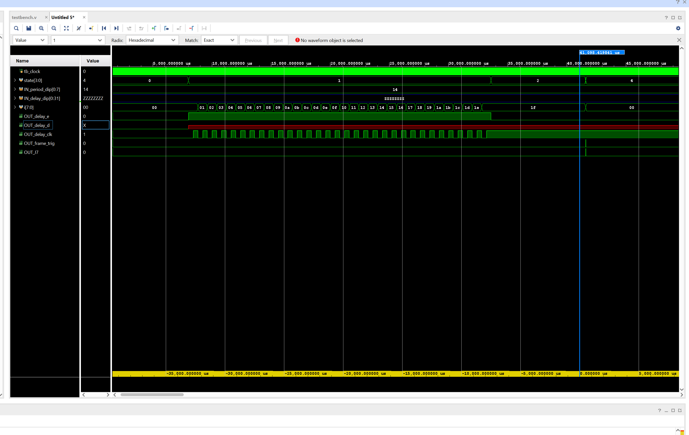
</div>

<!-- Verification -->
### Scope Snippets
<p><div align="left">
  There are the oscilloscope screen shots taken from the the actual hardware.
  The 10Hz signal is fed from a signal generator. 
  #40MHz Clock Image
  <div align="center">
  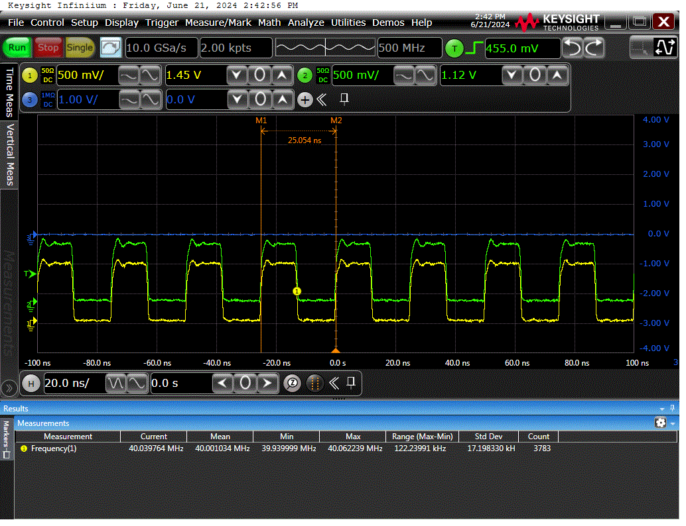
  <p>Image :40MHz clock signal </p>
  </div>


</p></div>

###  Compilation Report
The compilation report can be found here!!

The terminal messages are placed here, there where some warnings that happened during compilation, and maybe need to be paid attention later if bugs are found.
assets/Compiler_Terminal_Messages.txt


##  RELEASES
Firmware for Radars are compiled and the .jed images are generated, however the bit stream for the camera HYDRA remains the same as the older compilation.

