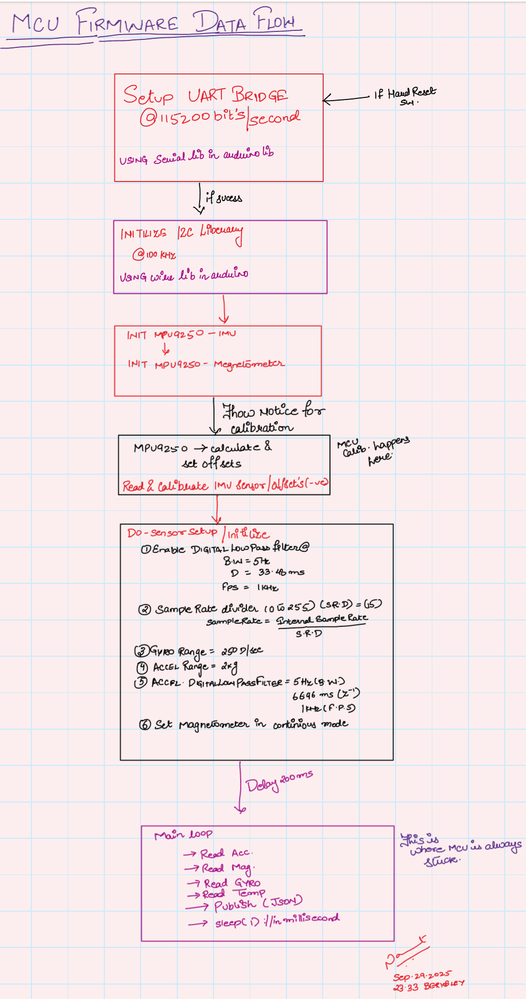
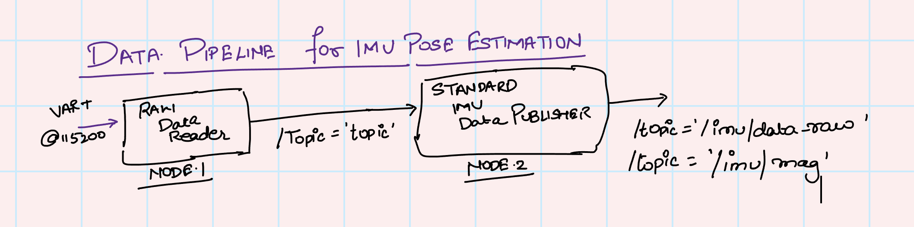

# IMU Pose Estimator In Ros2 RViz

## Video Blogs
- [Live Data Plotter- quick Video]](https://youtu.be/YiuW1HXjquA) 
- [YouTube Video Overview Long](https://youtu.be/0akgwjF98Gg)
- [Live 3D Pose Tracking in RViz](https://youtu.be/example3)

## Introduction

**🎯 Real-Time 3D Pose Tracking with ROS2 & RViz**

Ever wondered how robots, drones, and VR headsets know exactly how they're oriented in 3D space? This project brings that same cutting-edge technology to life through a complete hardware-software pipeline that transforms raw sensor data into stunning real-time 3D visualizations!

**The Magic Behind the Motion:**
- **🧠 Smart Sensor Fusion**: Harnessing the power of the MPU9250 9-axis IMU (accelerometer, gyroscope, and magnetometer) to capture every twist, turn, and tilt
- **⚡ Real-Time Processing**: An ATMEGA-328P microcontroller acts as the bridge, translating sensor data over I2C and streaming it via USB-UART
- **🎨 3D Visualization**: ROS2 nodes seamlessly process the data stream, feeding RViz's powerful visualization engine to create immersive 3D pose tracking

*Watch as raw sensor data transforms into smooth, accurate 3D pose estimation in real-time—the same technology powering autonomous vehicles and advanced robotics systems.*

<!-- Table of Contents -->

# :notebook_with_decorative_cover: Table of Contents

- [1.0 Introduction](#introduction)

  - [1.1 Features](#features)
  - [1.2 Main Silicion Components](#main-silicon-components)

- [2.0 Hardware Overview](#hardware-overview)

- [3.0 MCU PC Interface](#mcu-pc-interface)
    - [3.1 Termianl Data Monitor ](#terminal-data-monitoring)
    - [3.1 Data Structure ](#-data-format--structure)
- [4.0 MCU Firmware Loop Data Flow](#mcu-firmware-flow)

- [5.0 Sesnor Data Pipeline](#sensor-data-pipeline)

## Intro 
### Main Silicon Components 
 - MPU-9250 - MEMS Sensor Device
 - ATMEGA328P - MicroController 
 - 5V TTL_USB Cable - Protocol Converter Cable to Convert UART to USB interface


## Hardware Overview

<!-- Block Diagram of Hardware Used-->


<p><div align="center"> IMAGE-1 - Hardware Block Diagram </div> </p>

## MCU PC Interface

### Communication Protocol

The ATMEGA-328P interfaces with the PC using a **5V TTL-USB bridge** at a baud rate of **115,200 bits/second**. This creates a reliable serial communication channel for streaming real-time sensor data.
<br><br> `ToDo :` Later I want to run the same data over the `usb-uart` bridge as a physical layer but use a ``ModBus``  protocol to better deal with data corruption over transmission.

### Data Format & Structure

The microcontroller outputs **JSON-formatted sensor data** containing all 9-axis measurements plus temperature:

```json
{
  "accel": {"x": 0.12, "y": -0.05, "z": 1.02},
  "gyro": {"x": 0.15, "y": -0.23, "z": 0.08},
  "mag": {"x": 25.4, "y": -18.7, "z": 42.1},
  "temp": 23.5
}
```

### ⚙️ Sensor Configuration

**MPU9250 Setup:**
- **Accelerometer Range**: ±2g (high precision for orientation)
- **Gyroscope Range**: ±250°/s (optimal for pose tracking)
- **Magnetometer**: 100Hz continuous mode
- **Digital Low Pass Filter**: Level 6 (lowest noise, 5Hz bandwidth)
- **Sample Rate**: 1kHz with 15x divider = ~66Hz effective rate

### Firmware Features

**Smart Calibration:**
- Automatic offset compensation for flat positioning
- Gyroscope drift correction
- Temperature-compensated readings

*This interface demonstrates the complete hardware-software bridge from raw sensor data to structured, real-time data streams ready for advanced robotics applications.*

### Terminal Data Monitoring

To view the real-time sensor data stream in the terminal, use the following minicom command:

```bash
minicom -D /dev/ttyUSB0 -b 115200
```
**NSingh Pro Tips for minicom:**
- Use `Ctrl+A` then `X` to exit minicom
- For persistent connection: `minicom -D /dev/ttyUSB0 -b 115200 -C sensor_data.log`
- Check available ports: `dmesg | grep tty` after connecting

<!-- Block Diagram of Hardware Used-->


<p><div align="center"> IMAGE-2 - A Still from MiniCom Terminal</div> </p>

## MCU Firmware Flow

### 🧠 Embedded System Architecture

The **ATMEGA328P** serves as the primary computational unit, implementing a real-time embedded system architecture optimized for high-frequency sensor data acquisition and processing.

### Real-Time Processing Pipeline


<p><div align="center"> IMAGE-3 - MCU Firmware Code Flow </div> </p>


## Sensor Data Pipeline

<p><div align="center"> IMAGE-4 - Software - Data Pipeline IMU </div> </p>


