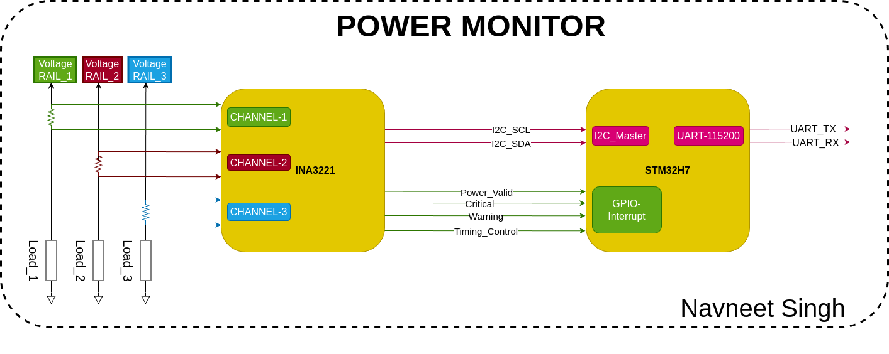
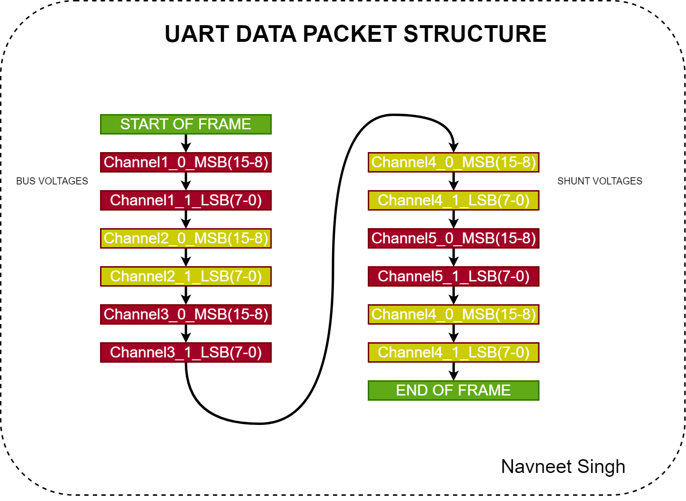
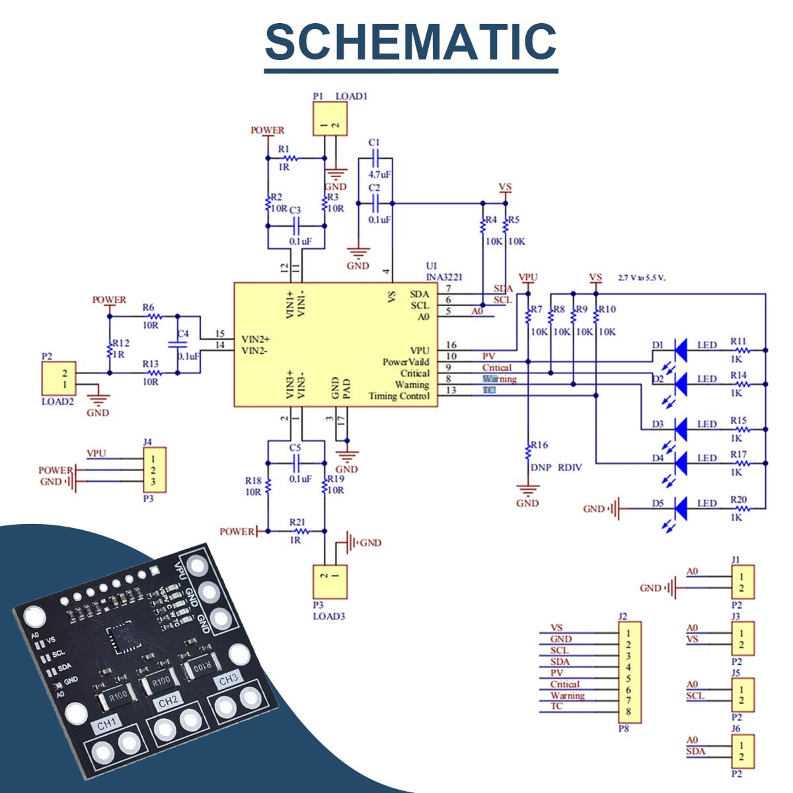
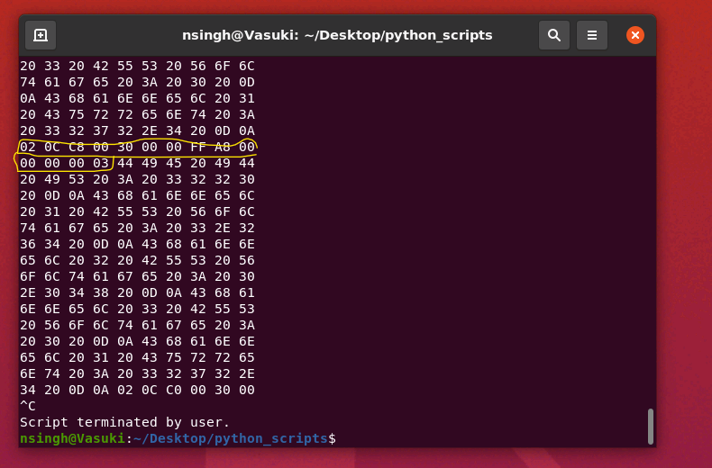

# Power Monitor

This power monitoring system leverages the capabilities of the INA3221 power monitor supervisor IC. It can measure voltage rails relative to GND and the shunt voltage across a shunt resistor, which can be translated by an MCU into current consumption values for each voltage rail. Additionally, the system includes various alert and supervisor functions that can be configured to provide protection for circuits, ensuring robust and reliable power management.

The data rail voltage and rail current consumption on each rail is preprocessed on the STM32, and then compressed into packets which are then provided to the Host over a UART communication lines. A TUI written for this is used to visualize the data coming from the sensor.

<!-- Block Diagram of the Power Monitor -->


<!-- Table of Contents -->
# :notebook_with_decorative_cover: Table of Contents

- [1.0 Introduction](#introduction)
  * [1.1 Features](#features)
  * [1.2 Main Silicion Components](#main-silicon-components)

- [2.0 System Overview](#system-overview)
    * [2.1 INA3221 Measurements BUS Voltage](#ina3221-measurements-bus-voltage)
    * [2.2 INA3221 Measurements SHUNT Voltage](#ina3221-measurements-shunt-voltage)
    * [2.3 INA3221 Measurements SHUNT SUMMATION](#ina3221-measuremetns-shunt-summation)

- [3.0 STM32H7 Data Flow](#stm32h7-data-flow)
    - [3.1 UART Packet Encoding and Decoding Scheme](#uart-packet-encoding)
    - [3.2 UART Properties Sender Side](#)
    - [3.2 UART Properties Receiver Side](#)

- [4.0 (x86) Linux Application](#linux-application)
- [5.0 Hardware Design & Other Constrains](#hardware-design)
    * [5.1 INA3221 Hardware Design](#ina3221-breakout-board)
- [6.0 Conclusion](#firmware)

<!-- Introduction -->
##  Introduction
<p><div align="left">
This power monitoring system leverages the capabilities of the INA3221 power monitor supervisor IC. It can measure voltage rails relative to GND, thus providing the absolute rail voltage and also the shunt voltage across a shunt resistor, which can be translated by an MCU into current consumption values for each voltage rail. Additionally, the system includes various alert and supervisor functions that can be configured to provide protection for circuits, ensuring robust and reliable power management.<br>

### Features
+ Voltage rails measurement 0-26 Volts.
+ Current Consumption on each rails.
+ Programmable Alert and Warning Outputs, on MCU GPIO interrupts.
+ Software controlled reset.
+ Averaging mode on IC upto 1024 number of samples that are averaged.

### Main Silicon Components 
+ INA3221 - (Texas Instruments)
+ STM32H743 - (STMicro)
+ FTDI USB to UART (FTDI)
+ Voltage Regulator (STMicro)

## System Overview
INA3221 is used to measure the various voltages and also performs the analog to digital conversion for the various systems measurements that are needed for the power monitoring and supervision purpose. Various native measurements that are performed on the INA3221 IC itself are Bus_Voltage, Shunt_Voltage and Shunt_Voltage_Sum.

The Bus_Voltage is simply a ADC reading on the IN_1,IN_2,IN_3 pins of the INA3221 IC. This bus voltage can only go 26_Volts on that pin. This voltage can be measured with a accuracy of 8mV, this is driven by the ADC of the INA3221.

The Shunt_Voltage is a difference voltage reading on the two ends of the SHUNT_Resistor. Voltage measurements on pins VIN+1__VIN-1, VIN+2__VIN-2, VIN+3__VIN-3. The voltage difference and the accurate value of resistance can be used to calculate the current flowing through that rail.

The per channel voltages can be summed up or averaged by the INA3221 FSM itself. The configration register space 11-9 bit, can be used to define how many samples are summed up to make a valid reading. Values include 1,4,16,64,128,1024. Default value is 1, I have not played with it much to see the effect. But the mathematical implications are Lower Noise and Accuracy improvement.

The INA3221 communicates with the MCU on the I2C bus. The max operating frequency for the SCL line is 2.44MHz. This is only the case for the high speed mode which needs a repeated start condition for entering a high speed communication mode. in Fast/Normal mode the maximum frequency of communication is not more then 0.4MHz(400Khz).

### INA3221 Measurements BUS Voltage
The BUS_VOLTAGE is stored in the register space at addresses 0x02, 0x04, and 0x06 for the respective channels. To convert the ADC digital reading to a floating-point value, follow these steps:

Right shift the ADC reading by 3 bits.
Multiply the result by 8mV to obtain the absolute voltage.
For the code implementation, refer to the following GitHub link: INA3221 Code Line on GitHub

### INA3221 Measurements SHUNT Voltage
The BUS_VOLTAGE is stored in the register space at addresses 0x01, 0x03, and 0x05 for the respective channels. To convert the ADC digital reading to a floating-point value, follow these steps:

Right shift the ADC reading by 3 bits.
Multiply the result by 40uV to obtain the absolute voltage.
Divide the value by the resistance of the SHUNT resistor on PCB (value in Amps)
Multiply the value by 1000 (value in mAmps)
For the code implementation, refer to the following GitHub link: INA3221 Code Line on GitHub

## STM32H7 Data Flow
The Firmware on STM32H7 is responsible for sending the data from the MCU to the main PC, on the UART bus. The BAUD RATE of the UART is 115200 Bits/second (needed to set up the host).

### UART PACKET ENCODING
The data coming out of the MCU will be in a form of data packets. Protocol that will be followed by the sender will be as follows.

SOF -> Data_0.1 -> Data_0.2 -> Data_1.0 -> Data_1.2 ......... -> EOF Each data packet is consisting of 16 bits of channel data. The protocol will have 6 channels, three for shut voltage and three for bus voltage.

``` bash
SOF : Start of Frame == 0x02
BYTE1 : DATA
BYTE2 : DATA
BYTE3 : DATA
BYTE4 : DATA
...
BYTE(n-2) : DATA
BYTE(n-1) : DATA
EOF (n) : END of Frame == 0x3

```

SOF EOF CONFLICT RESOLUTION
SOF/EOF Conflict Resolution When the data to be transmitted conflicts with the Start of Frame (SOF) or End of Frame (EOF) bytes, we will use a byte stuffing option. A special character will be transmitted before the conflicting byte, which will be an XOR of the conflict byte with the special character.
* Special Character: 0x1B
<!-- Block Diagram of the Encoding Data Protocol -->


## Hardware Design
The hardware part of the design can be divided into two subsections, part onw which deals with the implementation of INA3221 IC and the surrounding support needed by it, i.e. power supply, shunt resistors and decoupling caps. The second part of the hardware design is the implementation of the ARM MCU and its connection to the INA3221. for this implementation I am using the ARM development board from STM32H7.

### INA3221 Breakout Board

<!--Power Monitor Breakout Board Schematic Snippet -->



The following schematic board is used foe the implementation of the current sensor.

In the following board implementation the A0 pin of the INA3221 is tied to GND hence the device address is 0b1000000. This value is used to address the slave over the I2C bus.

<div style="clear: both;"></div>

## Linux Application 
<!--Power Monitor Breakout Board Schematic Snippet -->

